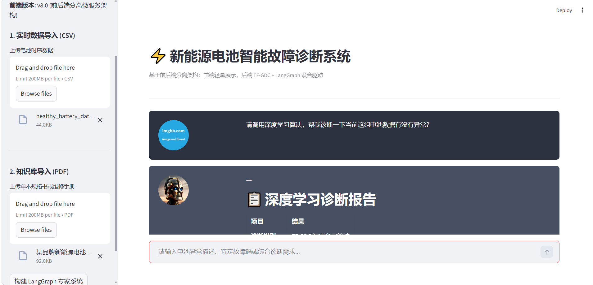
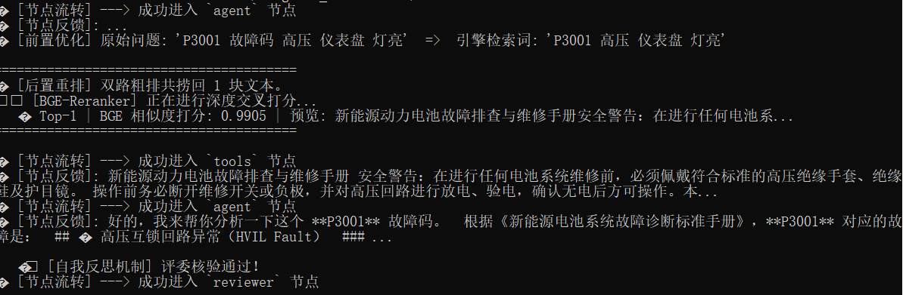

# 🔋 新能源电池智能诊断 Agent (Battery Diagnostic Agent)

本项目是一个结合了 **深度学习时序预测 (CPC-OSD)** 与 **大模型智能体 (Agent)** 的企业级辅助诊断原型系统。

## 🌟 核心架构设计

1. **网关层 (FastAPI)**：基于异步机制重构，提供标准 RESTful API，完美隔离 I/O 阻塞与 CPU 密集型计算。
2. **大脑层 (LangGraph)**：打破传统 AgentExecutor 的黑盒限制，采用状态机 (State Machine) 架构，实现“读取异常-> 评估阈值 -> 条件检索”的强制逻辑闭环。
3. **知识底座 (Hybrid RAG)**：集成 ChromaDB 稠密向量与 BM25 稀疏检索，通过哈希去重，彻底解决电池垂直领域专有名词的“语义塌陷”问题。
4. **物理引擎 (PyTorch)**：底层挂载自研时序预测模型，提取真实 MSE 误差，为 Agent 提供硬核的物理数值先验。

## 🚀 快速启动 (Quick Start)

### 1. 环境安装
```bash
pip install -r requirements.txt
## 📸 系统演示 (Demo)

## 📸 系统演示 (Demo)

**1. 前端智能诊断交互界面**

- **支持一键上传**电池时序数据与维修手册，实时渲染 Markdown 格式的高管级诊断报告。

**2. Agent 底层物理预测引擎 (TF-GDC)**

- **精准监控** Agent 截取滑动窗口、调用深度学习提取 MSE 误差的多步推理全过程。
---

## 🚀 快速启动 (Quick Start)

本系统采用彻底的前后端分离架构，并强依赖 Redis 进行多用户并发状态隔离。提供以下两种部署方式：

### 方案 A：企业级 Docker 一键部署（推荐 🌟）
无需配置复杂的 Python 与 Redis 环境，实现开箱即用：
```bash
# 1. 克隆仓库
git clone [https://github.com/programmer1003/Battery-Diagnostic-Agent.git](https://github.com/programmer1003/Battery-Diagnostic-Agent.git)
cd Battery-Diagnostic-Agent

# 2. 一键拉起微服务集群（包含 Redis 缓存、FastAPI 后端）
docker-compose up -d --build